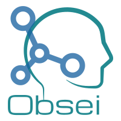

<p align="center">
  
</p>

<h1 align="center">obsei</h1>

<p align="center"><b>Voice of Customer without violating privacy.</b><br>
Open-source, self-hosted, AI-native feedback analytics. Bring your own sources, models and agents.</p>

<p align="center">
  <a href="https://docs.obsei.com/">Docs</a> ·
  <a href="https://docs.obsei.com/demo/">Live demo</a> ·
  <a href="https://obsei.com/">Website</a> ·
  <a href="https://github.com/obsei/obsei/discussions">Discussions</a>
</p>

<p align="center">
  <a href="https://github.com/obsei/obsei/actions/workflows/ci.yml"></a>
  <a href="https://pypi.org/project/obsei/"></a>
  <a href="https://github.com/obsei/obsei/pkgs/container/obsei"></a>
  <a href="https://github.com/obsei/obsei/blob/master/LICENSE"></a>
</p>

---

Teams want to understand what customers say in reviews, tickets, calls and surveys, but often can't
send that text to another SaaS or a public LLM. obsei runs entirely inside your own infrastructure:

- **Private by design.** PII is redacted (and optionally names) and authors are pseudonymised at
  ingest. Encrypted database, air-gapped by default, no telemetry, erasure and an audit log built in.
- **Bring your own.** Your sources, your keys and your model: Ollama, vLLM, Azure OpenAI, OpenAI, or
  Bedrock and Vertex through LiteLLM.
- **AI-native.** A read-only MCP server and a Claude plugin, so agents answer questions about
  customers with cited, privacy-filtered evidence.
- **Every language.** Feedback is classified and quoted in its own language; themes group the same
  issue across 50+ languages with a local multilingual model.

obsei provides controls that *support* compliance with laws such as the GDPR, India's DPDP Act,
Brazil's LGPD and California's CCPA. It makes no compliance claims; you remain the data controller.

> [!NOTE]
> 1.0 is a new codebase, not compatible with 0.0.x, and is in pre-release: install it with the `>=1.0.0a1` specifier.
> A plain `pip install obsei` still gives 0.0.15, whose code lives on the `legacy/0.0.x` branch.

## Quickstart

```bash
uv tool install "obsei[mcp]>=1.0.0a1"   # or: pip install "obsei[mcp]>=1.0.0a1"
mkdir voc && cd voc
obsei init                             # obsei.yaml plus a 10-language sample dataset
export OBSEI_DB_KEY="$(openssl rand -hex 24)" OBSEI_PSEUDONYM_SALT="$(openssl rand -hex 24)"
obsei try                              # preview redacted records; nothing stored or sent
obsei run                              # fetch, redact, enrich, deliver, store
obsei serve                            # scheduled pipelines, webhooks, MCP and Studio
obsei doctor                           # environment, encryption, egress mode, plugins
```

Uncomment the `classify` enricher in `obsei.yaml` to label sentiment, intent and language with a
local model (Ollama by default). Any OpenAI-compatible endpoint works: vLLM, llama.cpp, Azure
OpenAI, OpenAI, Mistral, or a LiteLLM proxy for Bedrock and Vertex. Public endpoints are refused
until you choose `OBSEI_EGRESS_MODE=private` (with `OBSEI_EGRESS_ALLOW`) or `hybrid`.

| | Built in |
| --- | --- |
| Sources | CSV, JSON Lines, declarative REST, webhooks, App Store (any country), App Store Connect, Google Play (official API), GitHub issues, Hacker News, Bluesky, YouTube, RSS/Atom, SQL databases and warehouses, file drops, IMAP mailboxes, any MCP server, Zendesk, Freshdesk, Intercom, Gong; Reddit as an unpublished community plugin (install from Git) |
| Enrichers | LLM classification (sentiment, intent, language, custom fields), cascade to a stronger model on low confidence |
| Sinks | Webhook (HMAC-signed), Slack, GitHub issues, Jira, Linear, Parquet, SQL databases and warehouses |
| Analysis | Stable themes (offline, or multilingual with `obsei[embeddings]`) with near-duplicate detection, k-anonymous views, `obsei ask` with cited answers, read-only Studio with a knowledge-graph explorer ([demo](https://docs.obsei.com/demo/)), Slack `/obsei` command |
| Privacy | Checksum-validated PII redaction for the Americas, Europe, UK, Asia-Pacific, India and Africa in any script; optional name redaction (`obsei[names]`); salted author pseudonyms; encrypted DuckDB; `obsei forget`, `obsei export` and `obsei audit` |
| Server | `obsei serve`: scheduled pipelines, signed webhook intake, MCP over HTTP, Studio, role-based access and SSO-proxy support |

Agents: `obsei mcp` serves read-only MCP tools; the Claude Code plugin is
`/plugin marketplace add obsei/obsei`. See the [docs](https://docs.obsei.com/) and
[integrations](integrations/README.md).

Docker (run in the project directory; images are tagged by release):

<!-- x-release-please-start-version -->
```bash
docker run --rm -v "$PWD:/data" -w /data --user "$(id -u):$(id -g)" \
  -e OBSEI_DB_KEY -e OBSEI_PSEUDONYM_SALT ghcr.io/obsei/obsei:1.0.0-alpha.1 run
```
<!-- x-release-please-end -->

## Roadmap

Phases 0.1 to 0.4 (private core, MCP and Claude plugin, enterprise bring-your-own, themes and
Studio) are in the 1.0 pre-releases. Next: live-connector validation, a release candidate, then the
1.0.0 launch. See [ROADMAP.md](ROADMAP.md).

## Contributing

Questions and ideas go to [Discussions](https://github.com/obsei/obsei/discussions). See
[CONTRIBUTING.md](CONTRIBUTING.md) for setup, conventions and the DCO sign-off.

## License

[Apache-2.0](LICENSE)
